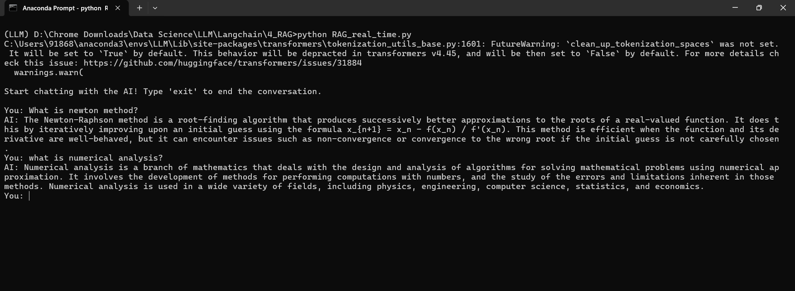

# Real_Time_RAG
Chat with you PDF <\br>
Hey Everyone!, This is a simple but powerful script to chat with your data. 
## Step 1 
Create vector embedding by running embedding.py file, What it does, it will create a vector embedding for the pdf file(I have provided numerical_analysis.pdf file), and it will automatically create the Vector Store.
## Step 2
Run this script in the command prompt(or anaconda prompt) to chat with your data, You can change the max token parameter to get more explicit answer.

# Thanks!

